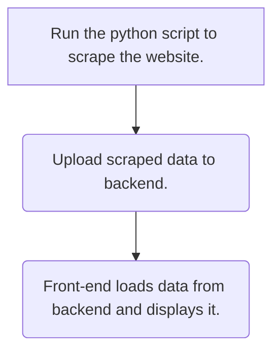

# Information Scraper
## A simple implementation of web scraping using Scrapy

[](https://github.com/scrapy/scrapy)

Markdown made with [Dilinger.io](https://dillinger.io/)
## Features

- Data scraping, capable of handling pagination in webpages 
- [Django](https://www.djangoproject.com/) backend to store and serve scraped data .
- [React](https://www.mongodb.com/) front-end to visualise data using 

Treat this repo as a first step on your journey to learning about scraping. 

## Logical flow of this project

The whole process occurs in multiple stages, this section aims to briefly explain those stages before running the code.


## Installation

This project was designed on [node](https://nodejs.org/en) v18.18.2 for the front-end and [python](https://www.python.org/) 3.9 on the backend. 

Optional, create a virtual environment to run backend
```sh
python -m venv venv
venv\Scripts\Activate.ps1
```

Install the dependencies start the server. From the root folder:
```sh
pip install -r requirements.txt
cd .\WebScraper\
py .\manage.py makemigrations     
py .\manage.py migrate     
py .\manage.py runserver       
```

Run the scraper.  From the root folder:
```sh
cd .\ScrapeZusMelaka\
make scrape_and_upload
```

Launch front-end.  From the root folder:
```sh
cd .\my-ts-app\
npm i
npm i -D @types/leaflet
npm start
```
